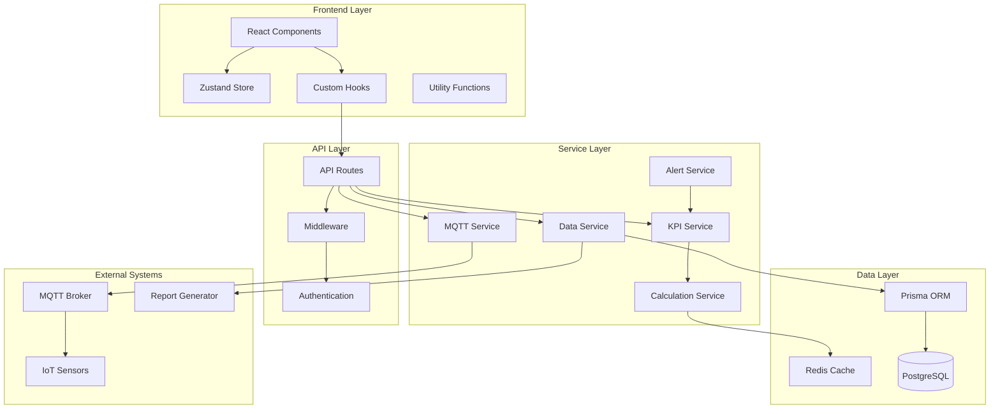
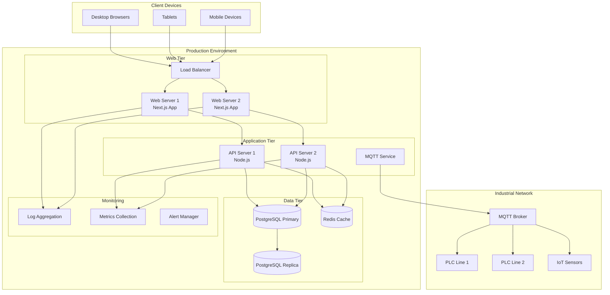
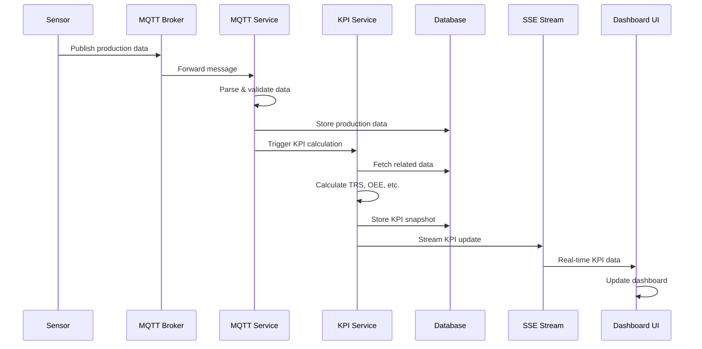
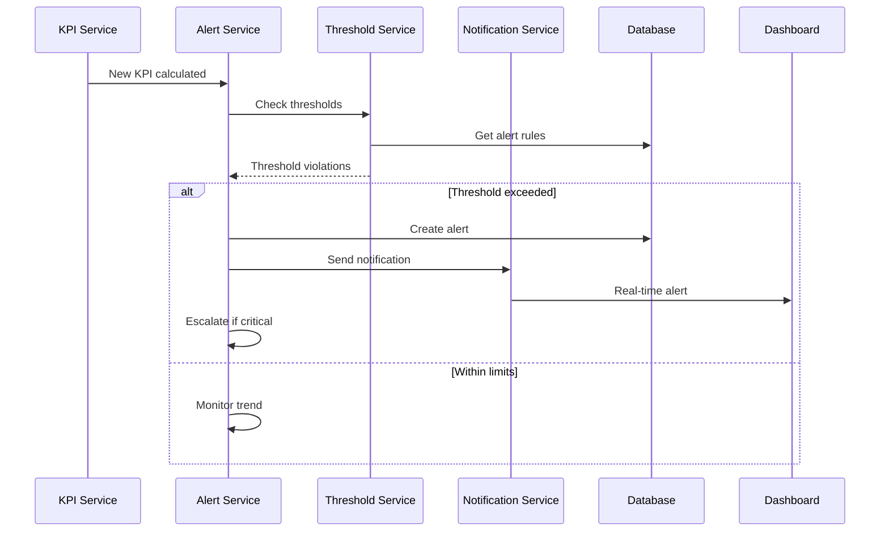
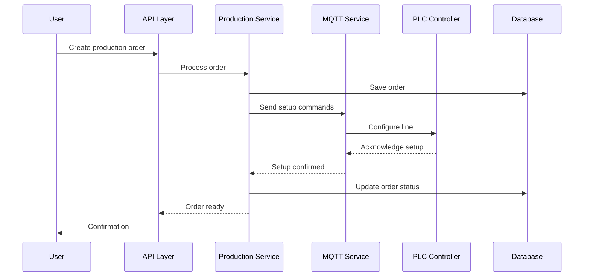
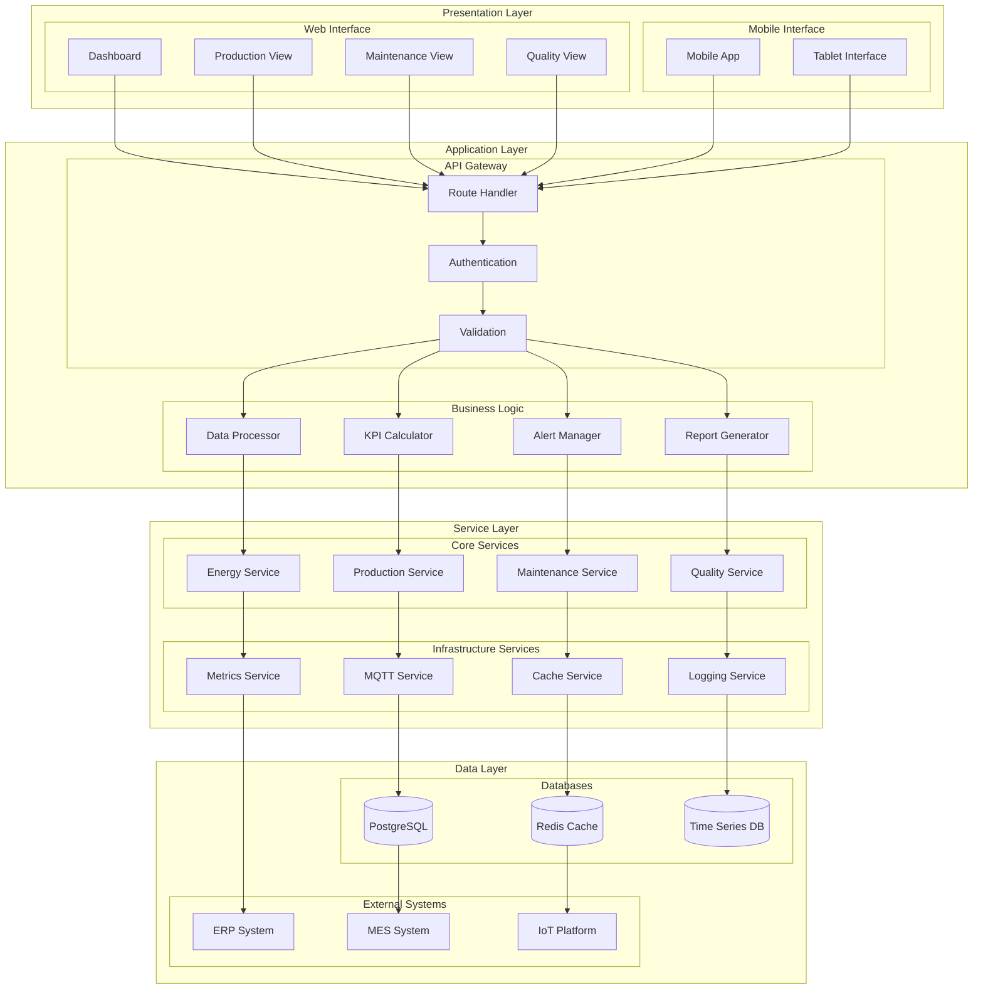
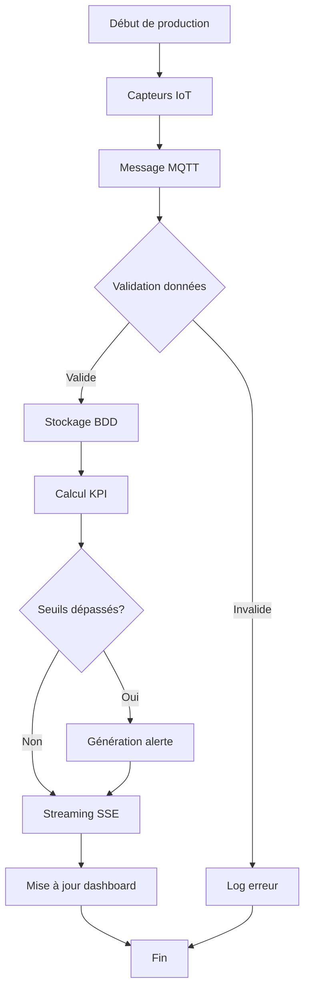
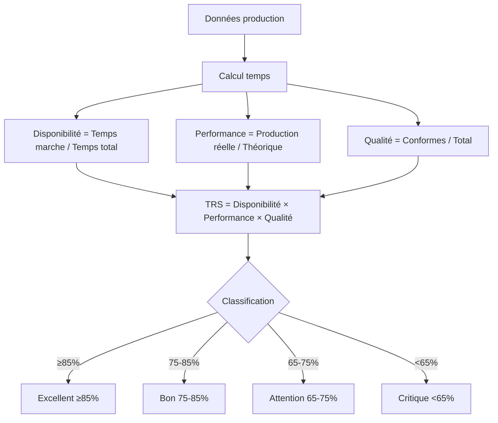
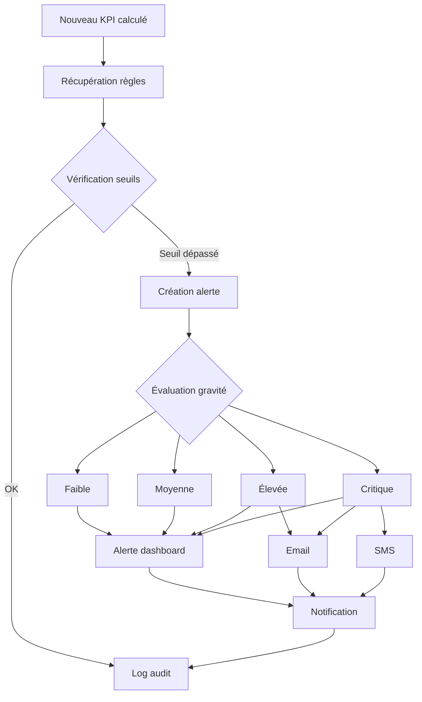

# Diagrammes UML et Schémas Techniques - KPI Dashboard

## Table des Matières

1. [Diagramme de classes](#1-diagramme-de-classes)
2. [Diagramme de composants](#2-diagramme-de-composants)
3. [Diagramme de déploiement](#3-diagramme-de-déploiement)
4. [Diagrammes de séquence](#4-diagrammes-de-séquence)
5. [Diagramme d'architecture](#5-diagramme-darchitecture)
6. [Flux de données](#6-flux-de-données)

---

## 1. Diagramme de classes

### 1.1 Domaine Production

```mermaid
classDiagram
    class ProductionData {
        +String id
        +DateTime timestamp
        +String lineId
        +Int bottlesProduced
        +Int defectiveBottles
        +Float actualRate
        +Float targetRate
        +Boolean isRunning
        +String shiftId
        +Float temperature
        +Float pressure
        +calculateTRS() Float
        +calculateOEE() Float
    }

    class ProductionOrder {
        +String id
        +String productCode
        +String productName
        +Int targetQuantity
        +Int actualQuantity
        +DateTime plannedStartTime
        +DateTime actualStartTime
        +DateTime plannedEndTime
        +DateTime actualEndTime
        +String status
        +String priority
        +String lineId
        +getProgress() Float
        +isLate() Boolean
    }

    class KPISnapshot {
        +String id
        +DateTime timestamp
        +Float trs
        +Float availability
        +Float performance
        +Float quality
        +Float oee
        +String lineId
        +String shiftId
        +Int totalProduced
        +Int totalDefects
        +Float downtimeHours
        +calculateEfficiency() Float
    }

    ProductionData ||--o{ KPISnapshot : "calcule"
    ProductionOrder ||--o{ ProductionData : "génère"
```

### 1.2 Domaine Maintenance

```mermaid
classDiagram
    class Equipment {
        +String id
        +String name
        +String type
        +String location
        +String status
        +DateTime lastMaintenanceDate
        +DateTime nextMaintenanceDate
        +String specifications
        +Float mtbf
        +Float mttr
        +calculateAvailability() Float
        +needsMaintenance() Boolean
    }

    class MaintenanceTask {
        +String id
        +String equipmentId
        +String type
        +String description
        +String status
        +String priority
        +DateTime plannedDate
        +DateTime completedDate
        +String assignedTo
        +Float estimatedDuration
        +Float actualDuration
        +String notes
        +markCompleted() Void
        +isOverdue() Boolean
    }

    Equipment ||--o{ MaintenanceTask : "a"
    Equipment ||--o{ EnergyConsumption : "consomme"
```

### 1.3 Domaine Personnel

```mermaid
classDiagram
    class Employee {
        +String id
        +String firstName
        +String lastName
        +String employeeNumber
        +String position
        +String department
        +DateTime hireDate
        +String status
        +String skills
        +Float performanceScore
        +Float efficiencyScore
        +Float qualityScore
        +Float safetyScore
        +calculateOverallScore() Float
    }

    class ShiftRecord {
        +String id
        +String employeeId
        +DateTime shiftStart
        +DateTime shiftEnd
        +String shiftType
        +String lineAssignment
        +String role
        +Int unitsProduced
        +Int qualityIssues
        +String notes
        +calculateProductivity() Float
    }

    class Training {
        +String id
        +String name
        +String description
        +String type
        +Int durationHours
        +String certification
        +DateTime expiryDate
        +String status
        +isExpired() Boolean
    }

    Employee ||--o{ ShiftRecord : "travaille"
    Employee }o--o{ Training : "suit"
```

---

## 2. Diagramme de composants



---

## 3. Diagramme de déploiement



---

## 4. Diagrammes de séquence

### 4.1 Mise à jour KPI en temps réel



### 4.2 Gestion des alertes



### 4.3 Traitement commande de production



---

## 5. Diagramme d'architecture



---

## 6. Flux de données

### 6.1 Flux de données de production



### 6.2 Flux de calcul TRS



### 6.3 Flux de gestion des alertes



---

## Légendes et Conventions

### Symboles utilisés
- `[]` : Processus/Action
- `{}` : Décision/Condition
- `()` : Données/Information
- `||--o{` : Relation One-to-Many
- `}o--o{` : Relation Many-to-Many

### Codes couleur (si applicable)
- 🟢 Vert : État normal/Bon
- 🟡 Jaune : Attention/Warning
- 🔴 Rouge : Critique/Erreur
- 🔵 Bleu : Information/Process

### Niveaux de priorité
- **P1** : Critique (résolution immédiate)
- **P2** : Élevée (résolution < 4h)
- **P3** : Moyenne (résolution < 24h)
- **P4** : Faible (résolution < 72h)

Ces diagrammes UML complètent la documentation technique et offrent une vision graphique claire de l'architecture et des flux du système KPI Dashboard.