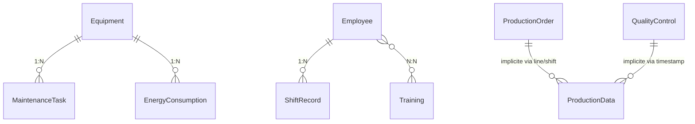

# Documentation Complète du Système de Monitoring Industriel KPI Dashboard

## Table des Matières

1. [Vue d'ensemble du projet](#1-vue-densemble-du-projet)
2. [Architecture technique](#2-architecture-technique)
3. [Modèle de données et relations](#3-modèle-de-données-et-relations)
4. [Technologies utilisées](#4-technologies-utilisées)
5. [Modules fonctionnels](#5-modules-fonctionnels)
6. [API et endpoints](#6-api-et-endpoints)
7. [Communication temps réel](#7-communication-temps-réel)
8. [Indicateurs de performance (KPI)](#8-indicateurs-de-performance-kpi)
9. [Interface utilisateur](#9-interface-utilisateur)
10. [Sécurité et gestion des données](#10-sécurité-et-gestion-des-données)

---

## 1. Vue d'ensemble du projet

### 1.1 Présentation générale

Le **KPI Dashboard** est une application web de monitoring industriel en temps réel conçue pour superviser les performances d'une ligne d'embouteillage. Ce système permet de suivre, analyser et optimiser les indicateurs de performance clés (KPI) dans un environnement de production industrielle.

### 1.2 Objectifs principaux

- **Monitoring temps réel** : Surveillance continue des performances de production
- **Calcul automatique des KPI** : TRS (Taux de Rendement Synthétique), OEE, disponibilité, performance, qualité
- **Gestion des alertes** : Système d'alertes intelligent basé sur des seuils configurables
- **Analyse historique** : Stockage et analyse des données de performance
- **Optimisation des processus** : Identification des points d'amélioration
- **Reporting avancé** : Génération de rapports détaillés

### 1.3 Domaine d'application

- **Secteur** : Industrie agroalimentaire (ligne d'embouteillage)
- **Environnement** : Production industrielle automatisée
- **Utilisateurs cibles** : Superviseurs, opérateurs, managers de production, équipes maintenance

---

## 2. Architecture technique

### 2.1 Architecture globale

Le système suit une architecture **full-stack moderne** basée sur :

```
┌─────────────────────────────────────────────────────────┐
│                    Frontend (Next.js)                  │
├─────────────────────────────────────────────────────────┤
│                API Routes (Next.js 15)                 │
├─────────────────────────────────────────────────────────┤
│              Services & Logic Layer                    │
├─────────────────────────────────────────────────────────┤
│                Database (PostgreSQL)                   │
├─────────────────────────────────────────────────────────┤
│              MQTT Broker (Communication IoT)           │
└─────────────────────────────────────────────────────────┘
```

### 2.2 Stack technologique

- **Frontend** : Next.js 15 (React 19), TypeScript, Tailwind CSS
- **Backend** : Next.js API Routes, Node.js
- **Base de données** : PostgreSQL avec Prisma ORM
- **Communication temps réel** : MQTT, Server-Sent Events (SSE)
- **État global** : Zustand
- **Charts & Visualisation** : Recharts
- **UI Components** : Radix UI, Lucide Icons

### 2.3 Patterns architecturaux

- **MVC Pattern** : Séparation claire entre modèles, vues et contrôleurs
- **Repository Pattern** : Couche d'abstraction pour l'accès aux données
- **Service Layer** : Logique métier centralisée
- **Observer Pattern** : Système d'événements pour les mises à jour temps réel

---

## 3. Modèle de données et relations

### 3.1 Entités principales

Le modèle de données comprend **17 entités principales** organisées autour de 6 domaines fonctionnels :

#### 3.1.1 Production & Opérations
- `ProductionData` : Données de production en temps réel
- `ProductionOrder` : Ordres de production et planification
- `KPISnapshot` : Instantanés des indicateurs de performance

#### 3.1.2 Qualité
- `QualityControl` : Contrôles qualité et non-conformités

#### 3.1.3 Maintenance & Équipements
- `Equipment` : Inventaire des équipements industriels
- `MaintenanceTask` : Tâches de maintenance préventive et corrective

#### 3.1.4 Personnel & Équipes
- `Employee` : Gestion du personnel
- `ShiftRecord` : Enregistrement des équipes et rotations
- `Training` : Formations et certifications

#### 3.1.5 Sécurité & Énergie
- `SafetyIncident` : Incidents et mesures de sécurité
- `EnergyConsumption` : Consommation énergétique

#### 3.1.6 Système & Monitoring
- `Alert` : Système d'alertes
- `Downtime` : Temps d'arrêt et pannes
- `AlertThreshold` : Seuils d'alerte configurables
- `SystemConfig` : Configuration système
- `Report` : Rapports générés
- `AuditLog` : Journal d'audit

### 3.2 Relations entre entités



### 3.3 Types de relations détaillées

#### Relations One-to-Many (1:N)
- **Equipment → MaintenanceTask** : Un équipement peut avoir plusieurs tâches de maintenance
- **Equipment → EnergyConsumption** : Un équipement génère plusieurs mesures de consommation
- **Employee → ShiftRecord** : Un employé a plusieurs enregistrements d'équipes

#### Relations Many-to-Many (N:N)
- **Employee ↔ Training** : Les employés peuvent participer à plusieurs formations

#### Relations implicites (via clés logiques)
- **ProductionOrder → ProductionData** : Liés via line/shift/timestamp
- **QualityControl → ProductionData** : Liés via timestamp et ligne de production

---

## 4. Technologies utilisées

### 4.1 Frontend Technologies

#### Next.js 15 & React 19
```json
{
  "next": "15.5.4",
  "react": "19.1.0",
  "react-dom": "19.1.0"
}
```
- **App Router** : Nouveau système de routage de Next.js
- **Server Components** : Rendu côté serveur optimisé
- **Turbopack** : Bundler ultra-rapide pour le développement

#### TypeScript
- **Type Safety** : Typage fort pour la fiabilité
- **Interface definitions** : Définitions d'interfaces métier complètes
- **Development Experience** : IntelliSense et détection d'erreurs

#### Styling & UI
```json
{
  "tailwindcss": "^4",
  "class-variance-authority": "^0.7.1",
  "clsx": "^2.1.1",
  "tailwind-merge": "^3.3.1"
}
```

### 4.2 Backend Technologies

#### Prisma ORM
```json
{
  "@prisma/client": "^6.17.1",
  "prisma": "^6.17.1"
}
```
- **Type-safe database access** : Accès base de données avec typage
- **Migration management** : Gestion des évolutions de schéma
- **Query optimization** : Optimisation automatique des requêtes

#### Communication & Real-time
```json
{
  "mqtt": "^5.14.1"
}
```
- **MQTT Protocol** : Communication IoT industrielle
- **Server-Sent Events** : Streaming temps réel vers le frontend
- **WebSocket alternative** : Solution légère pour les mises à jour

### 4.3 Data Visualization
```json
{
  "recharts": "^3.2.1",
  "lucide-react": "^0.545.0"
}
```

### 4.4 State Management
```json
{
  "zustand": "^5.0.8"
}
```

---

## 5. Modules fonctionnels

### 5.1 Module Dashboard Principal

**Fonctionnalités** :
- Vue d'ensemble temps réel des KPI
- Graphiques de performance en live
- Alertes actives et prioritaires
- Statut des équipements

**Composants clés** :
- `DashboardOverview` : Vue synthétique
- `RealTimeKPICards` : Cartes KPI temps réel
- `ProductionChart` : Graphique de production
- `AlertPanel` : Panel d'alertes

### 5.2 Module Production

**Fonctionnalités** :
- Gestion des ordres de production
- Suivi de la cadence de production
- Analyse des performances par ligne
- Mix produits et planification

**API Endpoints** :
- `GET /api/production/orders` : Liste des ordres
- `GET /api/production/history` : Historique de production

**Métriques calculées** :
- OEE (Overall Equipment Effectiveness)
- Efficacité par ligne
- Temps de setup
- Répartition par statut

### 5.3 Module Qualité

**Fonctionnalités** :
- Enregistrement des contrôles qualité
- Suivi des non-conformités
- Analyse des défauts par type
- Taux de conformité

**Indicateurs** :
- Taux de conformité global
- First Pass Yield (FPY)
- Coût des rebuts
- Actions correctives

### 5.4 Module Maintenance

**Fonctionnalités** :
- Planification maintenance préventive
- Gestion des interventions correctives
- Suivi des pièces de rechange
- Calcul MTBF/MTTR

**Types de maintenance** :
- **Préventive** : Maintenance planifiée
- **Corrective** : Réparation suite à panne
- **Emergency** : Intervention d'urgence

### 5.5 Module Équipes

**Fonctionnalités** :
- Gestion des équipes par shift
- Suivi des compétences et certifications
- Évaluation des performances
- Planification des formations

**Métriques personnel** :
- Score de performance
- Score d'efficacité
- Score qualité
- Score sécurité

### 5.6 Module Énergie

**Fonctionnalités** :
- Monitoring consommation énergétique
- Calcul empreinte carbone
- Optimisation des coûts
- Gestion des pics de demande

**Indicateurs énergétiques** :
- Consommation instantanée (kW)
- Coût mensuel (€)
- Ratio énergies renouvelables
- Efficacité énergétique

### 5.7 Module Sécurité

**Fonctionnalités** :
- Enregistrement des incidents
- Gestion des presqu'accidents
- Suivi des actions correctives
- Tableaux de bord sécurité

**Types d'incidents** :
- Accidents de travail
- Presqu'accidents (near miss)
- Conditions dangereuses
- Non-conformités sécurité

---

## 6. API et endpoints

### 6.1 Architecture API

L'API suit le pattern **RESTful** avec des endpoints organisés par domaine fonctionnel :

```
/api/
├── dashboard/
│   └── current/           # KPI temps réel
├── kpi/
│   └── stream/           # Streaming SSE des KPI
├── production/
│   ├── orders/           # Ordres de production
│   └── history/          # Historique production
├── maintenance/          # Tâches maintenance
├── quality/             # Contrôles qualité
├── teams/               # Gestion équipes
├── energy/              # Consommation énergétique
├── safety/              # Incidents sécurité
├── downtime/            # Temps d'arrêt
└── mqtt/
    └── connect/         # Connexion MQTT
```

### 6.2 Endpoints détaillés

#### Production API
```typescript
// GET /api/production/orders
interface ProductionOrdersResponse {
  orders: ProductionOrder[];
  metrics: ProductionMetrics;
  productionByLine: LineProduction[];
  productionMix: ProductMix[];
  statusDistribution: StatusDistribution[];
  oeeComponents: OEEComponent[];
}
```

#### KPI Streaming API
```typescript
// GET /api/kpi/stream (Server-Sent Events)
interface KPIStreamData {
  timestamp: string;
  production: {
    bottlesProduced: number;
    actualRate: number;
    targetRate: number;
    isRunning: boolean;
    temperature?: number;
    pressure?: number;
  };
  kpi: {
    trs: number;
    availability: number;
    performance: number;
    quality: number;
  };
  alerts: {
    active: number;
    downtime: number;
  };
}
```

### 6.3 Gestion des erreurs

L'API implémente une gestion d'erreurs standardisée :

```typescript
interface APIError {
  error: string;
  details?: string;
  status: number;
}
```

---

## 7. Communication temps réel

### 7.1 Architecture MQTT

Le système utilise **MQTT** pour la communication avec les équipements industriels :

```
Equipment Sensors → MQTT Broker → Dashboard Server → WebApp
```

#### Topics MQTT
- `production/+/data` : Données de production par ligne
- `production/+/status` : Statut des équipements

#### Message Types
```typescript
interface ProductionMessage {
  timestamp: string;
  count: number;
  rate: number;
  targetRate: number;
  defects: number;
  running: boolean;
  temperature?: number;
  pressure?: number;
}

interface StatusMessage {
  running: boolean;
  reason?: string;
  message?: string;
}
```

### 7.2 Server-Sent Events (SSE)

Pour la communication client-serveur temps réel :

```typescript
// Streaming des KPI toutes les 5 secondes
const eventStream = new EventSource('/api/kpi/stream');
eventStream.onmessage = (event) => {
  const kpiData = JSON.parse(event.data);
  updateDashboard(kpiData);
};
```

### 7.3 Gestion de la reconnexion

Le service MQTT implémente une logique de reconnexion automatique :

```typescript
class MQTTService {
  private reconnectAttempts = 0;
  private maxReconnectAttempts = 10;
  
  private scheduleReconnect() {
    const delay = Math.min(1000 * Math.pow(2, this.reconnectAttempts), 30000);
    setTimeout(() => this.connect(), delay);
  }
}
```

---

## 8. Indicateurs de performance (KPI)

### 8.1 TRS (Taux de Rendement Synthétique)

Le TRS est l'indicateur principal, calculé selon la formule :

```
TRS = Disponibilité × Performance × Qualité
```

#### Composants du TRS

**Disponibilité** :
```typescript
Disponibilité = (Temps de marche / Temps total) × 100
```

**Performance** :
```typescript
Performance = (Production réelle / Production théorique) × 100
```

**Qualité** :
```typescript
Qualité = (Unités conformes / Total produit) × 100
```

### 8.2 Seuils de performance

```typescript
export const KPI_THRESHOLDS = {
  TRS: {
    excellent: 85,
    good: 75,
    warning: 65
  },
  AVAILABILITY: {
    excellent: 90,
    good: 85,
    warning: 75
  },
  PERFORMANCE: {
    excellent: 95,
    good: 85,
    warning: 75
  },
  QUALITY: {
    excellent: 99,
    good: 97,
    warning: 95
  }
};
```

### 8.3 OEE (Overall Equipment Effectiveness)

Calcul OEE pour les équipements :

```typescript
const oee = (availability * performance * quality) / 10000;
```

### 8.4 Indicateurs secondaires

- **MTBF** (Mean Time Between Failures)
- **MTTR** (Mean Time To Repair)
- **First Pass Yield (FPY)**
- **Taux de conformité**
- **Efficacité énergétique**

---

## 9. Interface utilisateur

### 9.1 Design System

L'interface suit un **design system** cohérent basé sur :

- **Couleurs** : Palette professionnelle avec codes couleur par statut
- **Typography** : Inter font family pour la lisibilité
- **Spacing** : Système d'espacement cohérent (Tailwind CSS)
- **Components** : Composants UI réutilisables (Radix UI)

### 9.2 Navigation principale

```typescript
const navigation = [
  // Core
  { name: 'Dashboard', href: '/dashboard', icon: LayoutDashboard },
  
  // Production & Opérations
  { name: 'Production', href: '/production', icon: Factory },
  { name: 'Qualité', href: '/qualite', icon: Target },
  { name: 'Arrêts', href: '/arrets', icon: Clock },
  
  // Maintenance & Équipement
  { name: 'Maintenance', href: '/maintenance', icon: Wrench },
  { name: 'Appareils', href: '/appareils', icon: Wifi },
  
  // Personnel & Sécurité
  { name: 'Équipes', href: '/equipes', icon: Users },
  { name: 'Sécurité', href: '/securite', icon: Shield },
  
  // Monitoring & Alertes
  { name: 'Alertes', href: '/alertes', icon: AlertTriangle },
  { name: 'Énergie', href: '/energie', icon: Zap },
  
  // Analyse & Reporting
  { name: 'Historique', href: '/historique', icon: History },
  { name: 'Rapports', href: '/rapports', icon: FileText }
];
```

### 9.3 Composants UI principaux

#### Cartes KPI
```typescript
interface KPICardProps {
  title: string;
  value: number;
  unit: string;
  status: 'good' | 'warning' | 'critical';
  trend?: number;
  target?: number;
}
```

#### Graphiques temps réel
- **Line Charts** : Évolution temporelle des métriques
- **Bar Charts** : Comparaisons par période/équipe
- **Pie Charts** : Répartitions (mix produits, statuts)
- **Gauge Charts** : Indicateurs instantanés

### 9.4 Responsive Design

L'interface est entièrement responsive avec :
- **Desktop** : Layout complet avec sidebar
- **Tablet** : Navigation adaptée, graphiques optimisés
- **Mobile** : Interface simplifiée, navigation bottom

---

## 10. Sécurité et gestion des données

### 10.1 Sécurité des données

#### Audit Trail
```typescript
model AuditLog {
  id         String   @id @default(cuid())
  timestamp  DateTime @default(now())
  userId     String
  action     String   // 'create', 'update', 'delete'
  entity     String   // table name
  entityId   String?
  oldValues  String?  // JSON
  newValues  String?  // JSON
  ipAddress  String?
  userAgent  String?
}
```

#### Chiffrement
- **Données sensibles** : Chiffrement en base de données
- **Communications** : HTTPS/TLS pour toutes les communications
- **MQTT** : Authentification broker MQTT

### 10.2 Gestion des performances

#### Indexation base de données
```sql
-- Index pour les performances
@@index([timestamp])
@@index([shiftId])
@@index([status])
@@index([severity])
```

#### Optimisations
- **Pagination** : Limitation des résultats
- **Caching** : Mise en cache des KPI calculés
- **Background jobs** : Traitement asynchrone

### 10.3 Monitoring et observabilité

#### Logs applicatifs
- **Structured logging** : Format JSON pour les logs
- **Error tracking** : Capture et analyse des erreurs
- **Performance monitoring** : Suivi des performances API

#### Métriques système
- **Uptime** : Disponibilité du système
- **Response time** : Temps de réponse API
- **Throughput** : Débit de traitement des messages MQTT

---

## Conclusion

Ce système de monitoring industriel représente une solution complète et moderne pour le suivi des performances en temps réel d'une ligne d'embouteillage. L'architecture modulaire et les technologies choisies permettent une évolutivité et une maintenance facilitées, tout en garantissant des performances optimales pour un environnement industriel exigeant.

Le système s'intègre parfaitement dans une démarche d'**Industrie 4.0** en offrant :
- **Connectivité IoT** via MQTT
- **Analytics en temps réel** avec calculs KPI automatisés
- **Interface intuitive** pour tous les niveaux d'utilisateurs
- **Extensibilité** pour l'ajout de nouveaux modules métier

Cette documentation technique constitue une base solide pour comprendre l'architecture, les choix techniques et les relations entre les différents composants du système, facilitant ainsi sa maintenance, son évolution et sa documentation académique.